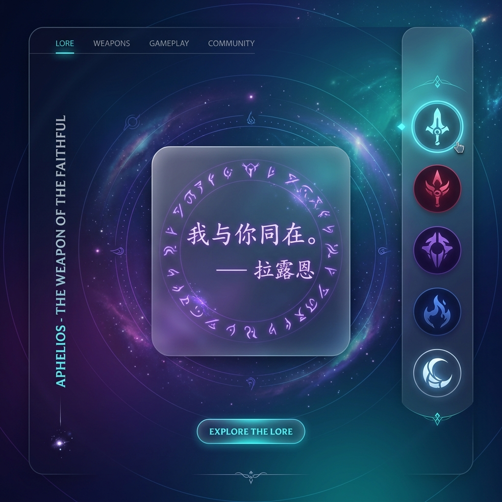
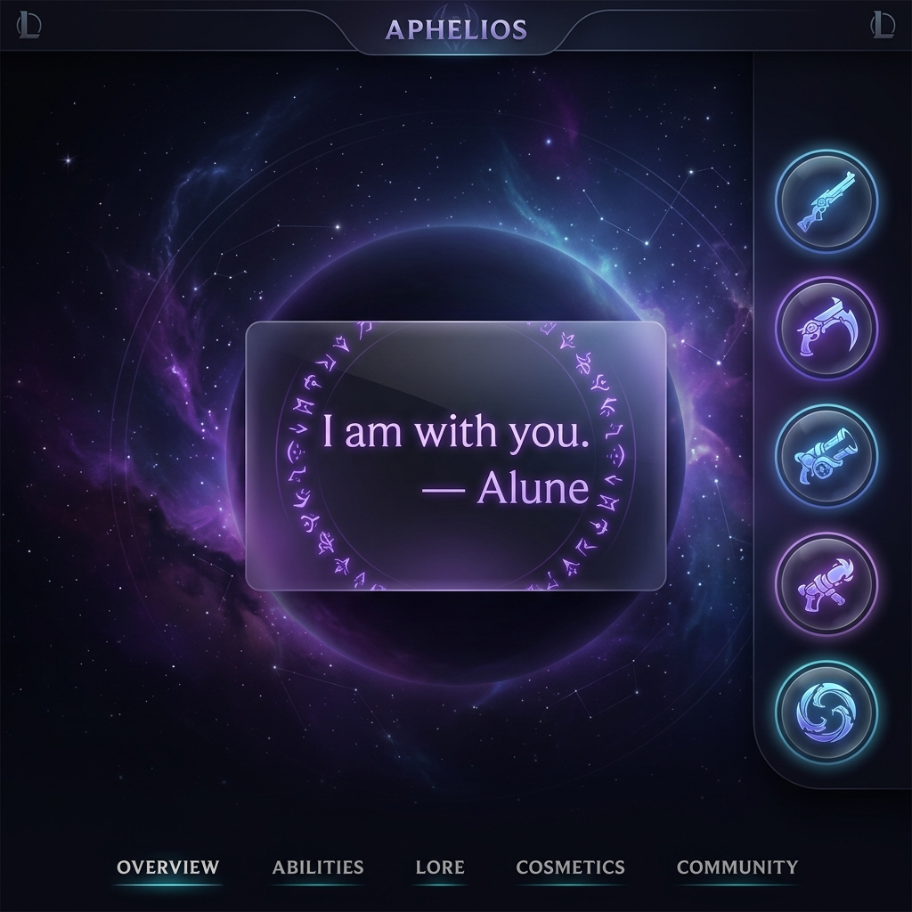
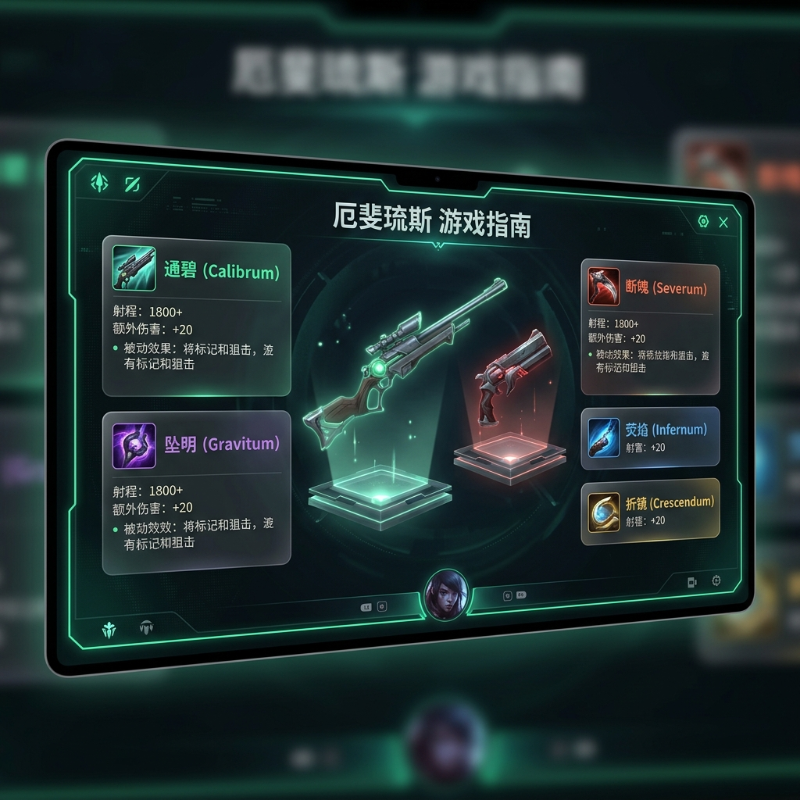
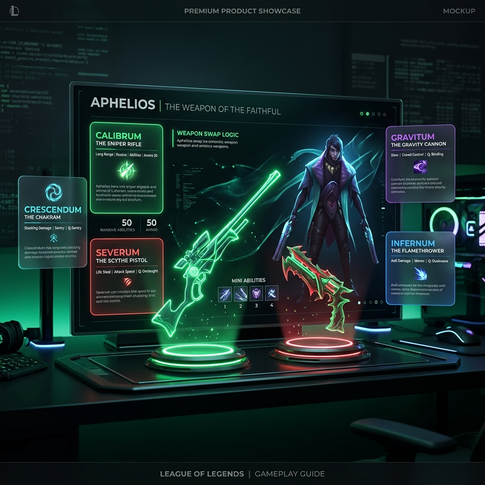
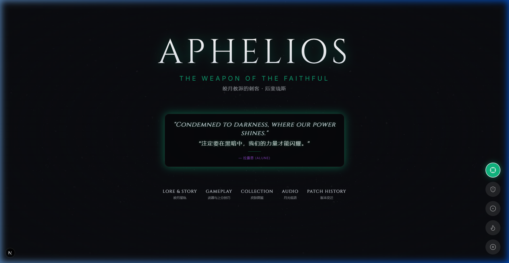
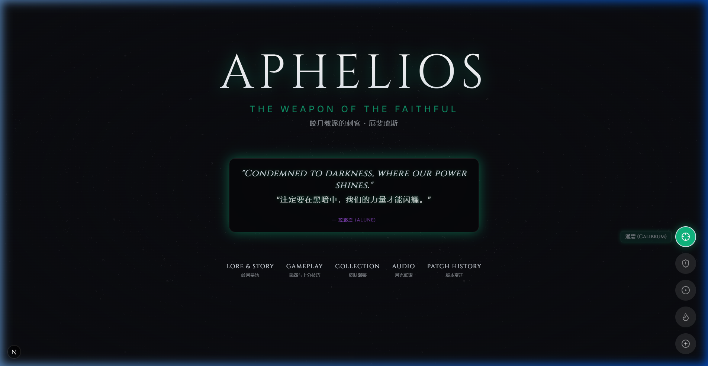
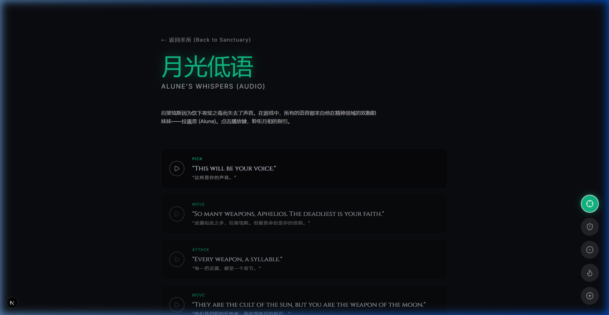
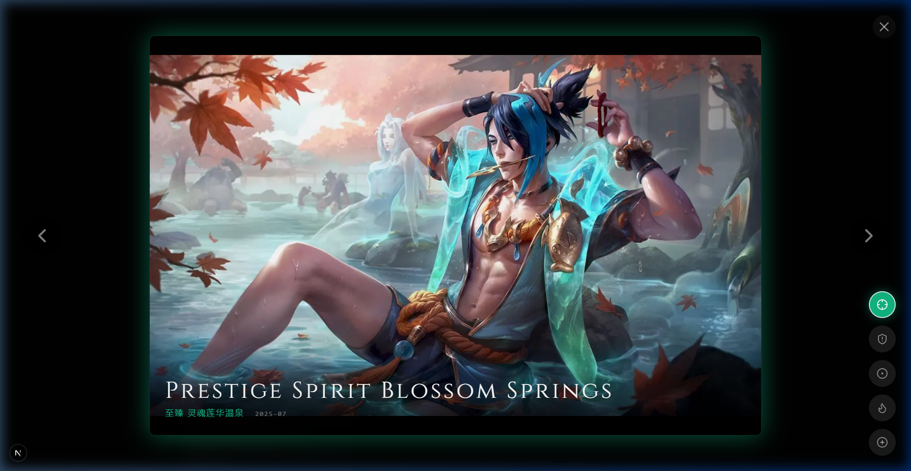

# Aphelios - The Weapon of the Faithful (厄斐琉斯同人主题站)

这是一个专为《英雄联盟》中皎月教派刺客**厄斐琉斯 (Aphelios)** 与其精神领域双胞胎妹妹**拉露恩 (Alune)** 制作的沉浸式同人粉丝网站。

网站采用现代暗黑美学设计，融合了教派与武器星轨元素，并支持基于五把武器（通碧、断魄、坠明、荧焰、折镜）的**动态主题色切换与发光环境光效 (Ambient Glow)**。

---

## 🌌 核心功能 (Core Features)

1. **🎨 动态武器主题色系统 (Dynamic Weapon Theme System)**
   - 采用 React Context 与全局 HTML 属性机制，在右下角提供五种武器选择器。
   - 切换武器后，网站整体的主题色、文字发光强度（`text-shadow`）、卡片边框、背景径向渐变均会平滑过渡为对应武器的主题视觉。
   - 切换按钮具有精美的提示框（Tooltip），在点击切换后会显示 2 秒后自动消失，并对移动端进行了防粘连（Hover Sticky）优化。

2. **🔊 月光低语 (Alune's Whispers - Audio)**
   - 收集了拉露恩（Alune）在局内对厄斐琉斯低语的经典中英文语音。
   - 支持实时点击播控，并对音频卡片在移动端的弹性布局进行了优化，防止播放图标在文本折行时发生形状挤压变形。

3. **🖼️ 皮肤图鉴 (Skins Gallery)**
   - 包含厄斐琉斯从经典原画到心之钢等所有精美皮肤的大图预览。
   - 支持带毛玻璃模糊滤镜（Backdrop Blur）的暗黑遮罩弹窗。
   - 对弹窗的“上一张”、“下一张”和“关闭”交互进行了绝对定位层级优化（`z-index`）与移动端尺寸微调，确保手机触控完美无遮挡。

4. **⚔️ 武器与机制 (Weapons & Mechanics)**
   - 详细列出了厄斐琉斯的基础属性（成长生命、攻速等）并针对移动端布局进行了对称的网格适配。
   - 深入讲解五把武器的被动效果、Q技能冷却、蓝耗、物理与魔法加成公式。
   - 包含三大核心控枪艺术与高阶爆发连招技巧（如红白刀贴脸输出、绿白刀超远狙击、蓝紫刀完美群控）。

5. **📖 皎月星轨 (Lore & Story)**
   - 讲述“夜月之子”厄斐琉斯和拉露恩的宿命羁绊，以及关于“夜绽之毒 (Noctum)”的背景故事。
   - 对引言块在不同分辨率下的容器高度自适应进行了重构，避免在窄屏手机上出现文字溢出。

6. **📜 版本星轨 (Patch History)**
   - 追溯厄斐琉斯自 2019 年底发布（V9.24）到最新版本（V26.13）以来的全部调整足迹。
   - 抛弃了粗略的概括性文字，将每个版本中具体的数值变动（如成长AD、标记伤害加成比例、技能吸血百分比、大招基础伤害和飞镖上限等）悉数列出。

---

## 🛠️ 技术栈 (Tech Stack)

- **核心框架**: Next.js 16 (App Router + Turbopack 极速编译)
- **渲染框架**: React 19
- **动效库**: Framer Motion (用于卡片淡入淡出、皮肤轮播等平滑动画)
- **图标库**: Lucide React
- **样式系统**: Tailwind CSS v4 + 现代 CSS 变量级主题引擎

---

## 🚀 快速开始 (Getting Started)

### 1. 克隆并安装依赖
```bash
git clone https://github.com/alongLFB/aphelios-fan-site.git
cd aphelios-fan-site
npm install
```

### 2. 运行本地开发服务器
```bash
npm run dev
```
打开浏览器访问 [http://localhost:3000](http://localhost:3000) 即可查看效果。

### 3. 构建与部署
构建用于生产环境的优化版本：
```bash
npm run build
npm run start
```

---

## 📂 项目关键文件结构
```text
src/
├── app/
│   ├── audio/         # 语音播放器页面
│   ├── gallery/       # 皮肤大图与预览画廊
│   ├── history/       # 详细版本补丁记录页面
│   ├── lore/          # 英雄背景故事页面
│   ├── mechanics/     # 核心属性与控枪连招指南
│   ├── globals.css    # 主题样式变量配置层
│   ├── layout.tsx     # 页面公共上下文包裹
│   └── page.tsx       # 圣所（主入口导航页）
├── components/
│   ├── QuoteCard.tsx      # Alune经典低语轮播展示卡片
│   └── WeaponSelector.tsx # 悬浮多维武器主题色选择器
└── context/
    └── WeaponContext.tsx  # 武器全局状态管理器 (HTML theme-data 绑定)
```

---

## 🖼️ 宣传截图与展示 (Screenshots & Mockups)

### 🎨 宣传设计概念图 (Promotional Design Mockups)
> 包含中英文双版本的概念性页面设计展示。

| 中文版 (Chinese Version) | 英文版 (English Version) |
| --- | --- |
|  |  |
|  |  |

---

### 💻 实际网页截图 (Live Site Screenshots)
> 在浏览器中运行本项目的真实截图展示。

- **主入口导航页 (Sanctuary - Default & Green Themes)**
  
  
  *默认暗黑主题视觉*

  
  *切换通碧（Calibrum）后的绿色发光环境主题视觉*

- **月光低语 (Audio Player)**
  
  
  *Alune 中英文语音卡片列表与优化后的播放按钮*

- **皮肤图鉴 (Skins Gallery Modal)**
  
  
  *新增的至臻 灵魂莲华温泉 (Prestige Spirit Blossom Springs) 皮肤大图弹窗预览与优化后的导航控件*

